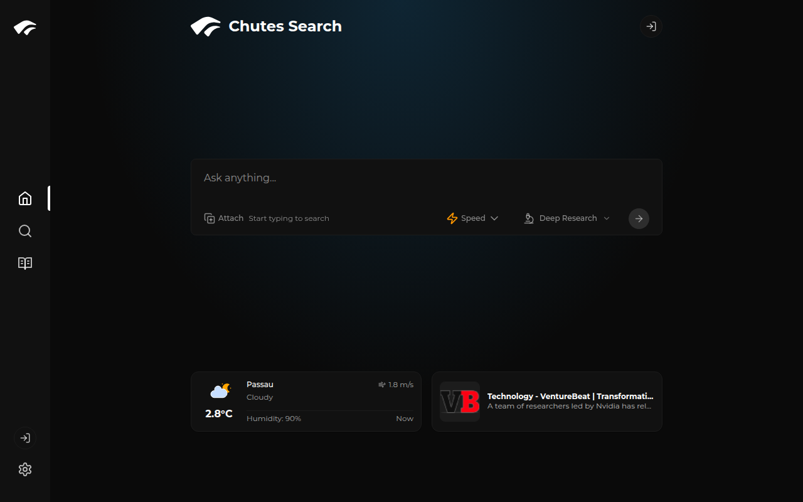
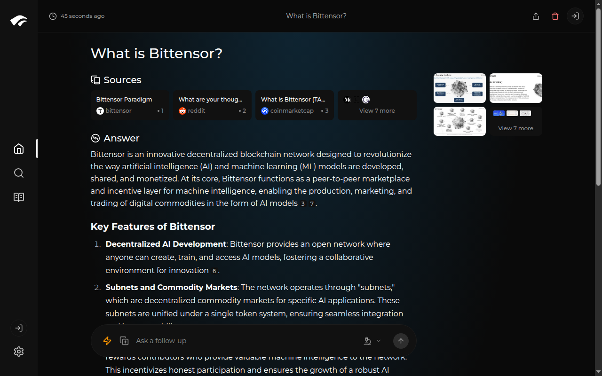

# Chutes Search

An AI-powered search engine built on [Chutes](https://chutes.ai), based on and giving full credit to the excellent [Perplexica](https://github.com/ItzCrazyKns/Perplexica) project.

Chutes Search serves as both a production search tool and a reference implementation for the [Chutes Dev Community](https://discord.gg/chutes) — showing how to build AI-powered applications using Chutes infrastructure, including OAuth ("Sign in with Chutes"), model inference, and sandbox-based deep research.



## Search in action



## What's different from Perplexica

- **Chutes as the AI backend** — LLM inference via [Chutes API](https://chutes.ai) (`llm.chutes.ai/v1`), with automatic model fallbacks across multiple providers
- **Sign in with Chutes** — OAuth 2.0 PKCE authentication via Chutes IDP, so users can search using their own Chutes account for unlimited queries
- **Free tier with rate limiting** — Anonymous users get 3 free searches/day (IP-hashed, privacy-preserving) with global throttles
- **Deep Research via Sandy** — Extended research mode that spins up sandboxed environments using [Sandy](https://github.com/chutesai/sandy) for agent-driven multi-step research
- **Neon Postgres** — Persistent storage via Neon serverless Postgres (replacing SQLite for serverless deployment)
- **Vercel deployment** — Runs on Vercel with `output: 'standalone'`, designed for serverless
- **Encrypted user data** — Chat messages, titles, and auth tokens encrypted at rest (AES-256-GCM per-user)
- **Optimization modes** — Speed, Balanced, and Quality modes route to different models

## Live demo

**[chutes-search.com](https://chutes-search.com)** — Try it out (3 free searches/day, or sign in with Chutes for unlimited)

## Architecture

- **Frontend**: Next.js 15 (App Router)
- **LLM**: Chutes API (OpenAI-compatible), with fallback chains
- **Search**: Serper API for web search, SearxNG-compatible
- **Database**: Neon Postgres via `@neondatabase/serverless` + Drizzle ORM
- **Auth**: Chutes IDP (OAuth 2.0 PKCE)
- **Deep Research**: Sandy sandboxes with Claude Code agents
- **Hosting**: Vercel (serverless)

## Focus modes

- **All Mode** — Searches the entire web for the best results
- **Writing Assistant** — Helps with writing tasks without web search
- **Academic Search** — Finds articles and papers for research
- **YouTube Search** — Finds relevant YouTube videos
- **Reddit Search** — Searches Reddit for discussions and opinions
- **Deep Research** — Multi-step agent-driven research using Sandy sandboxes (requires sign-in)

## Getting started

### Environment variables

```bash
# Required
DATABASE_URL=            # Neon Postgres connection string
SERPER_API_KEY=          # Serper.dev API key for web search

# Chutes AI (LLM inference)
CHUTES_API_KEY=          # Chutes API key (used for anonymous/free searches)
CHUTES_API_URL=          # e.g. https://llm.chutes.ai/v1
CHUTES_MODEL_NAME=       # e.g. deepseek-ai/DeepSeek-V3.1

# Chutes IDP (OAuth, optional)
CHUTES_IDP_CLIENT_ID=    # OAuth client ID
CHUTES_IDP_CLIENT_SECRET= # OAuth client secret
CHUTES_AUTH_SECRET=      # Encryption key for tokens/fields

# Deep Research (optional)
SANDY_BASE_URL=          # Sandy API endpoint
SANDY_API_KEY=           # Sandy API key
```

### Local development

```bash
git clone https://github.com/chutesai/chutes-search.git
cd chutes-search
npm install
cp sample.config.toml config.toml  # Edit with your settings
npm run dev
```

### Deploy to Vercel

The project is configured for Vercel with `output: 'standalone'`. Set the environment variables above in your Vercel project settings, then deploy.

The build runs `drizzle-kit push` automatically to sync the database schema.

## Credits

This project is a fork of [Perplexica](https://github.com/ItzCrazyKns/Perplexica) by [ItzCrazyKns](https://github.com/ItzCrazyKns). Perplexica is an outstanding open-source AI search engine that made this project possible. All original Perplexica contributors deserve recognition for their work.

## License

Same license as the upstream Perplexica project — see [LICENSE](LICENSE).
