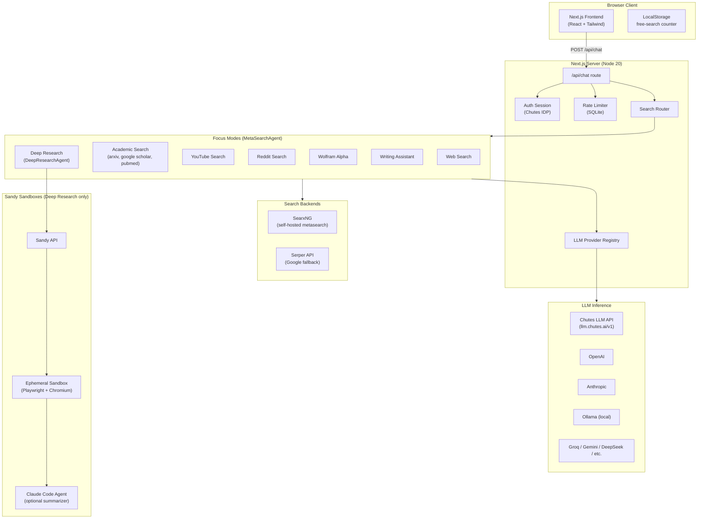
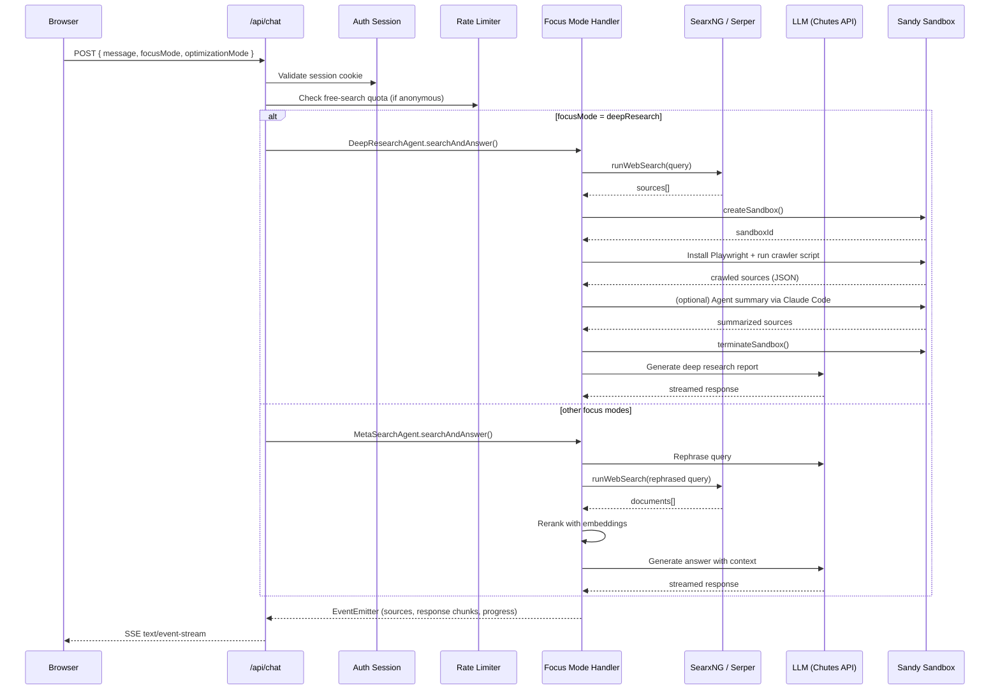
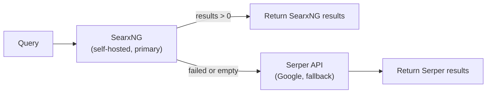
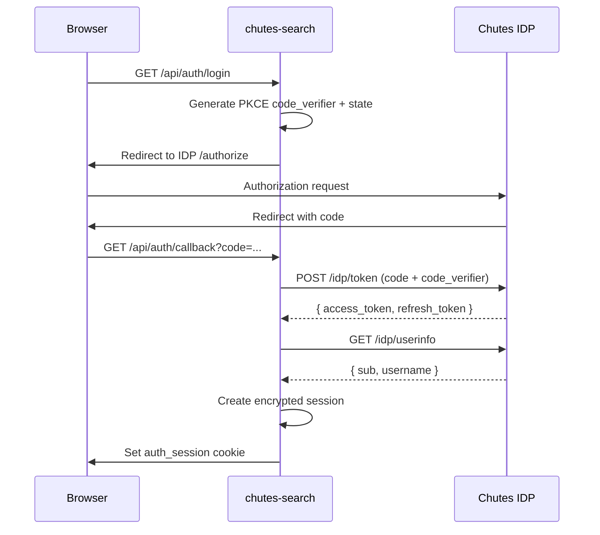

# Architecture Overview

chutes-search is an AI-powered web search engine with deep research capabilities. It is a fork of [Perplexica](https://github.com/ItzCrazyKns/Perplexica) (v1.11.0-rc2), extended with Chutes-specific integrations: Sandy sandbox-based deep research, Chutes IDP authentication, Janus model routing, and multi-model LLM fallbacks via the Chutes LLM API.

---

## High-Level Architecture

---

## Perplexica Fork: What Changed

chutes-search preserves Perplexica's core architecture (SearxNG-backed search, LangChain agent chains, Next.js full-stack app, cosine-similarity reranking) while adding several major features:

| Area | Perplexica (upstream) | chutes-search (fork) |
|---|---|---|
| **Authentication** | None (open access) | Chutes IDP OAuth2 PKCE with session management |
| **Rate limiting** | None | IP-based free-search quota (3/day) + global throttles |
| **Deep Research** | Not present | Sandy sandbox crawling with Playwright |
| **LLM routing** | Single provider at a time | Multi-candidate fallback with rate-limit retry |
| **Default provider** | User-configured | Chutes LLM API (OpenAI-compatible) |
| **Optimization modes** | Basic speed/balanced/quality | Model-per-mode mapping (Qwen3, Kimi-K2.5) |
| **Agent summarization** | Not present | Claude Code agent in sandbox for source synthesis |
| **Search fallback** | SearxNG only | SearxNG primary, Serper API fallback |
| **User isolation** | None | Session-scoped chat history (anonymous + authenticated) |

---

## Request Flow

A user submitting a query triggers this sequence:

---

## Focus Modes

Focus modes are registered in `src/lib/search/index.ts` as instances of either `MetaSearchAgent` or `DeepResearchAgent`. Each mode has its own prompt templates and engine configuration.

| Mode | Handler | Search Engines | Reranking | Web Search |
|---|---|---|---|---|
| `webSearch` | MetaSearchAgent | All (SearxNG default) | Yes (threshold 0.3) | Yes |
| `academicSearch` | MetaSearchAgent | arxiv, google scholar, pubmed | Yes (threshold 0) | Yes |
| `youtubeSearch` | MetaSearchAgent | youtube | Yes (threshold 0.3) | Yes |
| `redditSearch` | MetaSearchAgent | reddit | Yes (threshold 0.3) | Yes |
| `wolframAlphaSearch` | MetaSearchAgent | wolframalpha | No | Yes |
| `writingAssistant` | MetaSearchAgent | None | No | No |
| `deepResearch` | DeepResearchAgent | All + Sandy crawler | N/A (sandbox) | Yes |

### MetaSearchAgent Pipeline

The standard MetaSearchAgent (used by all modes except deep research) follows this pipeline:

1. **Query Analysis**: The LLM analyzes the user message in conversation context and decides whether a web search is needed. If not, it returns `not_needed`.
2. **Query Rephrasing**: The conversation history is used to produce a standalone search query.
3. **Web Search**: `runWebSearch()` tries SearxNG first, falls back to Serper if SearxNG fails or returns no results.
4. **Document Processing**: Results are converted to LangChain `Document` objects.
5. **Reranking**: Based on optimization mode:
   - **Speed**: No embedding-based reranking; top 15 results by position.
   - **Balanced**: Cosine similarity between query embedding and document embeddings, filtered by threshold.
   - **Quality**: Same as balanced with stricter filtering.
6. **Response Generation**: The LLM generates a cited, structured answer using the reranked context.

### Copilot Mode

Copilot mode (still under development from upstream Perplexica) enhances search by visiting the top-matched pages directly instead of relying only on SearxNG snippets. When a link-based query is detected, the agent fetches the linked pages, splits them into chunks, summarizes each, and uses those summaries as the context for response generation.

---

## LLM Provider System

chutes-search supports multiple LLM providers through LangChain adapters. Providers are loaded dynamically from `src/lib/providers/` and configured via `config.toml` or environment variables.

### Supported Providers

| Provider | Chat Models | Embedding Models | Configuration |
|---|---|---|---|
| Chutes (custom_openai) | Yes | No | `CHUTES_API_KEY`, `CHUTES_API_URL` |
| OpenAI | Yes | Yes | `OPENAI_API_KEY` |
| Anthropic | Yes | No | `ANTHROPIC_API_KEY` |
| Ollama | Yes | Yes | `OLLAMA_API_URL` |
| Groq | Yes | No | `GROQ_API_KEY` |
| Gemini | Yes | Yes | `GEMINI_API_KEY` |
| DeepSeek | Yes | No | `DEEPSEEK_API_KEY` |
| AI/ML API | Yes | Yes | `AIMLAPI_API_KEY` |
| LM Studio | Yes | Yes | `LM_STUDIO_API_URL` |
| Transformers | No | Yes | (built-in, `@xenova/transformers`) |

### Model Selection by Optimization Mode

When using the Chutes provider, the optimization mode maps to specific models:

| Optimization Mode | Default Model |
|---|---|
| Speed | `Qwen/Qwen3-Next-80B-A3B-Instruct` |
| Balanced | `moonshotai/Kimi-K2.5-TEE` |
| Quality | `moonshotai/Kimi-K2.5-TEE` |

### LLM Fallback Chain

The `buildChutesCandidates()` function (`src/lib/llm/fallbacks.ts`) creates an ordered list of model candidates. If the primary model returns a 429 (rate limit), the system automatically retries with the next candidate, provided no output has been streamed yet.

Default fallback order:
1. Primary model (selected by optimization mode)
2. `deepseek-ai/DeepSeek-V3`
3. `Qwen/Qwen2.5-72B-Instruct`
4. `NousResearch/Hermes-4-70B`

---

## Search Backend: SearxNG + Serper

Web search is handled by `runWebSearch()` in `src/lib/search/runWebSearch.ts`, which implements a two-tier fallback:

**SearxNG Configuration**: Multiple SearxNG instances can be configured via `SEARXNG_API_URLS` (comma-separated). A random instance is chosen per request for load distribution. The bundled `searxng/settings.yml` enables JSON format output, Google autocomplete, and the Wolfram Alpha engine.

**Serper Fallback**: The `SERPER_API_KEY` environment variable enables Serper as a paid Google search backup. Results include organic search, knowledge graph, and top stories.

---

## Authentication

chutes-search integrates with the Chutes IDP (Identity Provider) via OAuth2 PKCE flow:

Key details:
- Session data is encrypted at rest using `CHUTES_AUTH_SECRET`.
- Access tokens carry the `chutes:invoke` scope, allowing the user's own Chutes account to pay for inference.
- Sessions auto-refresh when tokens expire.
- Deep Research requires authentication (anonymous users get a 401).

---

## Rate Limiting

Anonymous users are subject to server-side rate limiting enforced in `src/lib/rateLimit.ts`:

| Tier | Limit | Scope |
|---|---|---|
| Per-IP daily | 3 searches/day | Hashed IP address |
| Global per-minute | 200 searches/min | All anonymous users |
| Global per-hour | 6,000 searches/hr | All anonymous users |

Client-side enforcement via `localStorage` provides a best-effort UX gate (`src/lib/freeSearch.ts`). IP addresses are stored as HMAC-SHA256 hashes for privacy.

---

## Data Storage

chutes-search uses SQLite (via `better-sqlite3` + Drizzle ORM) for all persistence:

| Table | Purpose |
|---|---|
| `users` | OIDC user profiles (sub, username) |
| `auth_sessions` | Encrypted auth session state |
| `chats` | Chat metadata (title, focusMode, sessionId, userId) |
| `messages` | Chat messages (human + assistant, with source metadata) |
| `ip_search_logs` | Per-IP daily search counters (hashed IPs) |
| `free_search_global_counters` | Minute/hour bucket throttle counters |
| `event_logs` | Anonymized application event logs |

The database is stored in the `DATA_DIR` directory (default `./data`) and survives container restarts via a Docker volume.

---

## Technology Stack

| Layer | Technology |
|---|---|
| Frontend | Next.js 15, React 18, Tailwind CSS, Markdown-to-JSX |
| Backend | Next.js API routes (Node.js runtime) |
| AI/ML | LangChain (chains, agents, embeddings), @xenova/transformers |
| Database | SQLite (better-sqlite3) + Drizzle ORM |
| Search | SearxNG (metasearch), Serper (Google API) |
| Auth | Chutes IDP (OAuth2 PKCE) |
| Sandboxing | Sandy API (Docker/Firecracker sandboxes) |
| Build | Docker multi-stage (Node 20 slim) |
