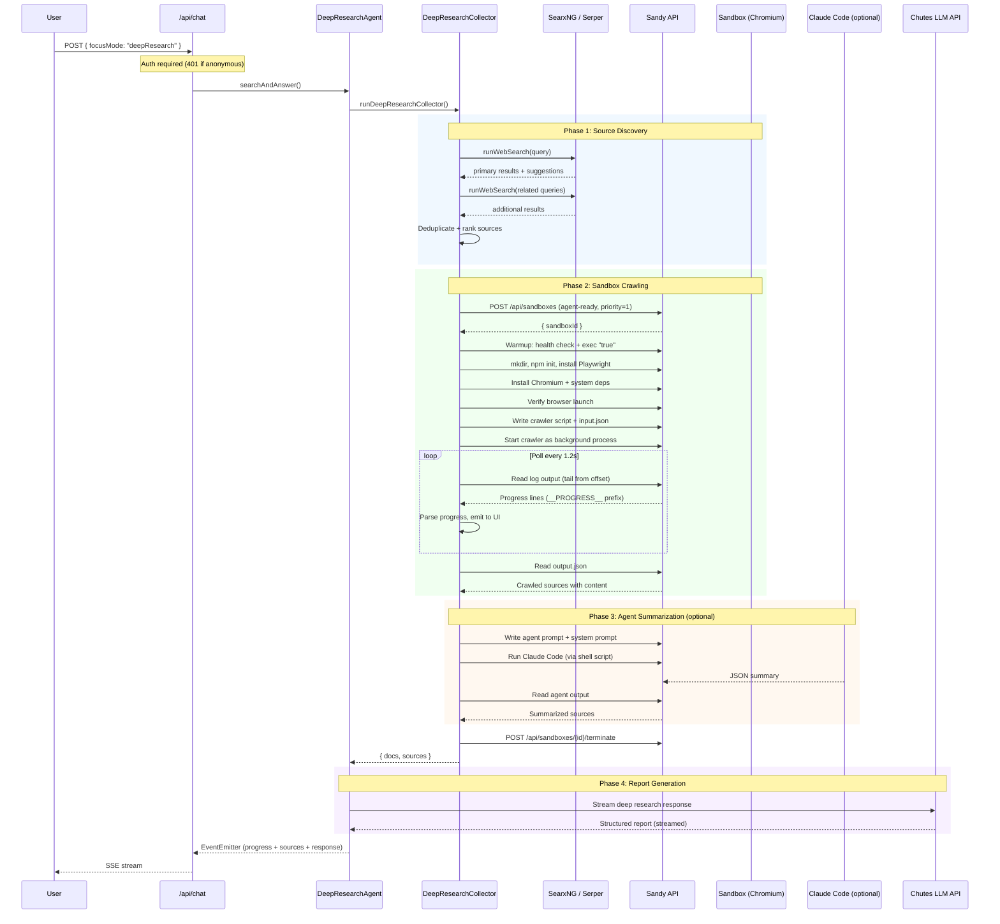
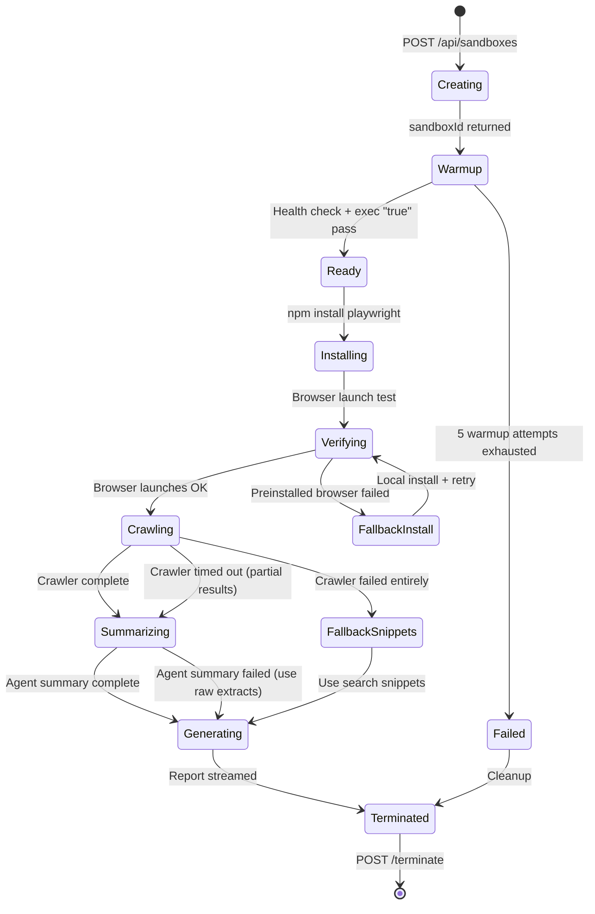
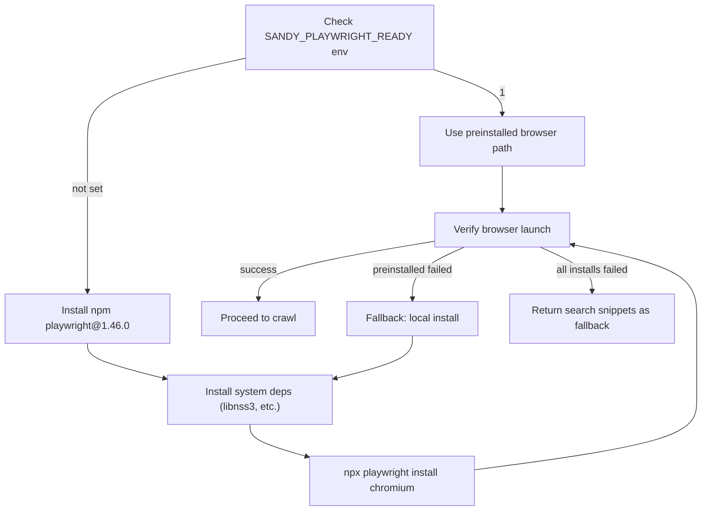

# Deep Research: Sandy Sandbox Integration

Deep Research is the most distinctive feature of chutes-search. When a user selects the "Deep Research" focus mode, the system creates an ephemeral Sandy sandbox, launches a headless Chromium browser inside it, crawls the discovered web pages, and optionally runs a Claude Code agent to synthesize the results before generating a structured research report.

---

## End-to-End Flow



---

## Deep Research Modes

The `deepResearchMode` parameter controls the scope and resource allocation of the research:

| Parameter | Light Mode | Max Mode |
|---|---|---|
| Max web search sources | 10 | 18 |
| Max chars per source | 8,000 | 12,000 |
| Max duration | 12 min | 18 min |
| Max pages crawled | 22 | 48 |
| Max crawl depth | 1 (seed pages only) | 2 (follow links) |
| Max links per page | 8 | 12 |
| Max pages per host | 4 | 8 |
| Related queries | 1 | 3 |
| Summary source limit | 12 | 20 |

These values are further scaled by the optimization mode:

| Optimization | Scale Factor | Duration Scale | Chars Scale |
|---|---|---|---|
| Speed | 0.7x | 0.7x | 0.8x |
| Balanced | 0.85x | 0.9x | 1.0x |
| Quality | 1.0x | 1.1x | 1.1x |

---

## Sandy Client Library

The Sandy client is implemented in `src/lib/sandy.ts` and provides these operations:

| Function | Sandy API Endpoint | Purpose |
|---|---|---|
| `createSandbox()` | `POST /api/sandboxes` | Create a new sandbox (agent-ready flavor, priority 1, non-preemptable) |
| `getSandboxStatus()` | `GET /api/sandboxes/{id}` | Check if sandbox is healthy and ready |
| `terminateSandbox()` | `POST /api/sandboxes/{id}/terminate` | Destroy the sandbox |
| `execInSandbox()` | `POST /api/sandboxes/{id}/exec` | Run a shell command inside the sandbox |
| `writeSandboxFile()` | `POST /api/sandboxes/{id}/files/write` | Write a file into the sandbox filesystem |
| `readSandboxFile()` | `GET /api/sandboxes/{id}/files/read` | Read a file from the sandbox filesystem |
| `listSandboxFiles()` | `GET /api/sandboxes/{id}/files/list` | List files in a sandbox directory |

### Retry and Error Handling

All Sandy API calls use exponential backoff retry with these defaults:

- **Timeout**: 10 minutes per request
- **Retries**: 3 (4 for sandbox creation)
- **Retry delay**: 1.5s initial, doubling per attempt
- **Retryable conditions**: HTTP 5xx, 429 (rate limit), "Upstream error" in response

---

## Sandbox Lifecycle



### Sandbox Configuration

The sandbox is created with these parameters:

```json
{
  "priority": 1,
  "preemptable": false,
  "flavor": "agent-ready"
}
```

- **Priority 1 (HIGH)**: User-facing search warrants fast allocation.
- **Non-preemptable**: The sandbox will not be reclaimed during the research session.
- **Agent-ready flavor**: The sandbox image includes Node.js and tools needed for Playwright.

### Warmup Phase

After creation, the collector performs up to 5 warmup attempts with exponential backoff (2s * attempt + random jitter). Each attempt checks:

1. Sandbox health via `GET /api/sandboxes/{id}`.
2. Command execution via `exec "true"`.

502 errors during warmup are expected (the sandbox may still be starting). If all attempts fail, the error is surfaced to the user.

---

## Crawler Script

The deep research collector dynamically generates a JavaScript research script (`buildResearchScript()` in `src/lib/search/deepResearchCollector.ts`) that runs inside the sandbox. The script:

1. **Launches Chromium** via Playwright in headless mode with `--no-sandbox`.
2. **Blocks media resources** (images, fonts, media) to speed up page loads.
3. **Processes a BFS queue** of URLs seeded from the search results:
   - Navigates to each URL with `domcontentloaded` wait strategy.
   - Waits 1.2s for JavaScript rendering.
   - Auto-scrolls the page (up to 25 iterations or 12s).
   - Extracts title, meta description, and body text.
   - Follows same-host links up to `maxDepth` levels.
4. **Enforces limits**: per-host page cap, total page cap, total duration cap.
5. **Emits progress** via `__PROGRESS__` prefixed lines on stdout.
6. **Writes output** as a JSON file containing all crawled sources.

### Progress Protocol

The crawler communicates progress back to the Node.js collector via structured stdout lines:

```
__PROGRESS__{"stage":"browser","status":"running","message":"Launching browser"}
__PROGRESS__{"stage":"crawl","status":"running","current":3,"total":22,"url":"https://example.com/page"}
__PROGRESS__{"stage":"crawl","status":"complete","message":"Crawl complete"}
```

The collector parses these lines in real-time (polling every 1.2s via `tail -c +{offset}`) and emits them as UI progress events.

### Output Reading and Fallbacks

Reading the crawler output is done with multiple fallback strategies:

1. **Primary**: `readSandboxFile()` (Sandy files API).
2. **Fallback**: Chunked read via `dd` through `execInSandbox()` (works when the files API truncates large files).
3. **Last resort**: `cat` via `execInSandbox()`.

If the output cannot be read or parsed, the system falls back to the original search snippets collected before the sandbox phase.

---

## Playwright Installation

The collector handles Playwright setup with a preinstalled-first, fallback-install strategy:



System dependencies installed via apt-get:
- libnss3, libnspr4, libdbus-1-3, libatk1.0-0, libatk-bridge2.0-0
- libcups2, libdrm2, libxkbcommon0, libatspi2.0-0
- libxcomposite1, libxdamage1, libxfixes3, libxrandr2, libgbm1, libasound2

The apt-get install retries up to 3 times with 20s delays to handle dpkg lock contention.

---

## Agent Summarization (Janus Router Integration)

After crawling, the collector can optionally run a Claude Code agent inside the sandbox to synthesize the collected sources. This feature is activated when both an API key and model are configured.

### Configuration

| Environment Variable | Purpose |
|---|---|
| `SANDY_AGENT_API_BASE_URL` | Base URL for the agent's LLM API (Janus router) |
| `SANDY_AGENT_ROUTER_URL` | Alternative name for the router URL |
| `JANUS_ROUTER_URL` | Third alternative for the router URL |
| `SANDY_AGENT_MODEL` | Model name (defaults to `janus-router` if a router URL is set) |
| `SANDY_AGENT_SYSTEM_PROMPT` | Custom system prompt appended to the Claude Code invocation |
| `JANUS_SYSTEM_PROMPT` | Alternative name for the system prompt |

### Agent Execution

The summarization agent is invoked as a shell script inside the sandbox:

```bash
#!/bin/sh
set -e
PROMPT="$(cat /workspace/deep-research/agent-prompt.txt)"
claude -p --output-format text --no-session-persistence --model "janus-router" \
  --append-system-prompt-file "/workspace/deep-research/agent-system-prompt.txt" \
  "$PROMPT" > /workspace/deep-research/agent-output.txt
```

The agent environment is configured with:

| Variable | Value |
|---|---|
| `ANTHROPIC_BASE_URL` | Janus router URL (or `https://claude.chutes.ai`) |
| `ANTHROPIC_AUTH_TOKEN` | User's access token (from auth session) |
| `ANTHROPIC_API_KEY` | Same as auth token |
| `API_TIMEOUT_MS` | 600000 (10 minutes) |
| `CLAUDE_CODE_DISABLE_NONESSENTIAL_TRAFFIC` | 1 |

### Agent Prompt Structure

The agent receives a structured prompt asking it to produce JSON:

```
You are a research analyst. Summarize the sources for the query below.
Return ONLY valid JSON with this shape:
{ "sources": [{ "title": string, "url": string, "summary": string, "keyPoints": string[] }],
  "overallInsights": string[] }
Keep each summary under 120 words. Keep keyPoints to 3-5 bullets.
Do not use tools or modify files. Do not include markdown fences.

Query: <user query>

Sources:
<JSON array of trimmed source objects>
```

Each source is trimmed to 2,000 characters before being sent to the agent.

### How Summaries Are Used

If agent summarization succeeds, the summaries replace the raw page content in the document objects passed to the final report generator. A `summaryMap` (keyed by URL) maps each source to its agent-produced summary. Sources without summaries fall back to their raw crawled content.

---

## Report Generation

After all sources are collected (and optionally summarized), the `DeepResearchAgent` generates the final report using a LangChain chain with the `deepResearchResponsePrompt`:

### Prompt Structure

The deep research response prompt instructs the LLM to produce:

1. **Executive summary** (2-4 sentences)
2. **Key findings** (bullet list)
3. **Evidence & context** (multiple paragraphs with [number] citations)
4. **Implications & trade-offs**
5. **Open questions / next steps**

### LLM Candidate Fallback

The report generation uses the same multi-candidate fallback system as regular searches. For Deep Research MAX mode, a separate set of high-quality summary models is used:

- `deepseek-ai/DeepSeek-V3`
- `Qwen/Qwen2.5-72B-Instruct`
- `NousResearch/Hermes-4-70B`

If a model returns a 429 rate limit error before any output has been streamed, the system retries with the next candidate.

---

## UI Progress Tracking

The Deep Research progress is displayed in the frontend via the `DeepResearchProgress` component (`src/components/DeepResearchProgress.tsx`). Progress steps are rendered in this fixed order:

| Step ID | Label | Description |
|---|---|---|
| `search` | Finding sources | Initial SearxNG/Serper web search |
| `sandbox` | Preparing sandbox | Sandy sandbox creation and warmup |
| `setup` | Installing Browser | Playwright and Chromium installation |
| `browser` | Launching browser | Chromium headless launch |
| `crawl` | Crawling pages | Page-by-page BFS crawling with progress bar |
| `analysis` | Synthesizing notes | Agent-based source summarization |
| `finalize` | Drafting report | LLM report generation |
| `cleanup` | Cleaning up sandbox | Sandbox termination |

Each step shows one of four states: pending, running (with spinner), complete (checkmark), or error (warning icon). The crawl step includes a percentage-based progress bar.

---

## Error Handling and Fallbacks

The deep research system is designed with graceful degradation at every stage:

| Failure Point | Fallback Behavior |
|---|---|
| Sandy sandbox creation fails | Fall back to standard web search |
| Sandbox warmup fails (502s) | Retry 5x, then fall back to web search |
| Playwright install fails | Return search snippets instead |
| Browser launch fails | Try local install, then return search snippets |
| Crawler times out | Return partial results collected so far |
| Crawler output unreadable | Try chunked read via exec, then use search snippets |
| Output JSON parse fails | Try chunked re-read, then use search snippets |
| Agent summarization fails | Use raw crawled content instead |
| Report LLM rate limited | Retry with fallback model |

All errors are logged to the `event_logs` table with anonymized details for debugging.
