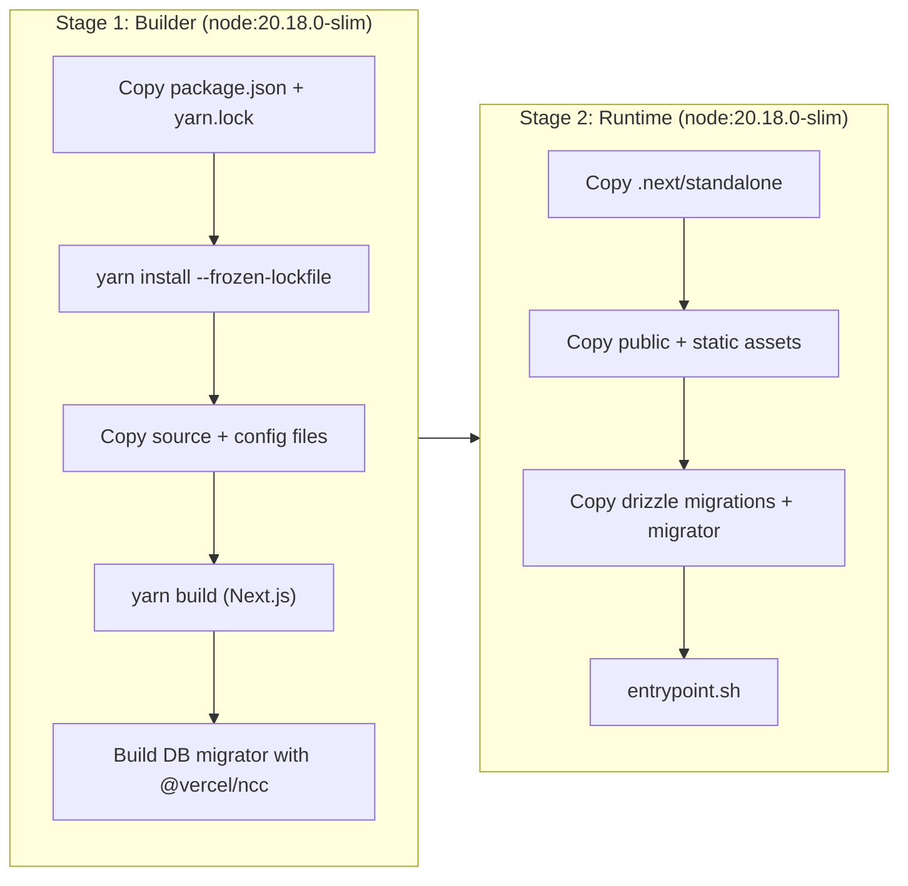

# Deployment and Configuration

This document covers the Docker Compose deployment of chutes-search, all environment variables, SearxNG configuration, and operational details.

---

## Docker Compose Setup

chutes-search ships with a `docker-compose.yaml` that runs two services:

```yaml
services:
  searxng:
    image: docker.io/searxng/searxng:latest
    volumes:
      - ./searxng:/etc/searxng:rw
    ports:
      - 4000:8080
    networks:
      - perplexica-network
    restart: unless-stopped

  app:
    image: itzcrazykns1337/perplexica:main
    build:
      context: .
      dockerfile: app.dockerfile
    environment:
      - SEARXNG_API_URL=http://searxng:8080
      - DATA_DIR=/home/perplexica
    ports:
      - 3000:3000
    networks:
      - perplexica-network
    volumes:
      - backend-dbstore:/home/perplexica/data
      - uploads:/home/perplexica/uploads
      - ./config.toml:/home/perplexica/config.toml
    restart: unless-stopped
```

### Services

| Service | Image | Internal Port | External Port | Purpose |
|---|---|---|---|---|
| `searxng` | `searxng/searxng:latest` | 8080 | 4000 | Metasearch engine |
| `app` | Built from `app.dockerfile` | 3000 | 3000 | chutes-search application |

### Volumes

| Volume | Mount Point | Purpose |
|---|---|---|
| `backend-dbstore` | `/home/perplexica/data` | SQLite database persistence |
| `uploads` | `/home/perplexica/uploads` | User file uploads |
| `./config.toml` | `/home/perplexica/config.toml` | Runtime configuration (bind mount) |
| `./searxng` | `/etc/searxng` | SearxNG settings (bind mount) |

---

## Docker Build

The `app.dockerfile` uses a multi-stage Node.js build:



### Entrypoint

The container entrypoint runs:

```bash
#!/bin/sh
set -e
node migrate.js    # Run Drizzle DB migrations
exec node server.js # Start Next.js standalone server
```

---

## Environment Variables

### Core Application

| Variable | Required | Default | Description |
|---|---|---|---|
| `CHUTES_API_KEY` | Recommended | - | API key for anonymous free searches (3/day per IP) |
| `CHUTES_API_URL` | No | `https://llm.chutes.ai/v1` | Chutes LLM API base URL |
| `CHUTES_MODEL_NAME` | No | `deepseek-ai/DeepSeek-V3.1` | Default model when none is specified |
| `CHUTES_AUTH_SECRET` | **Yes** | - | Secret for encrypting session/token data at rest |
| `DATA_DIR` | No | `./data` | Directory for SQLite database storage |

### Authentication (Chutes IDP)

| Variable | Required | Default | Description |
|---|---|---|---|
| `CHUTES_IDP_CLIENT_ID` | **Yes** | - | OAuth2 client ID for the app registration |
| `CHUTES_IDP_CLIENT_SECRET` | No | - | Client secret (omit for public clients) |
| `CHUTES_IDP_SCOPES` | No | `openid profile chutes:invoke` | OAuth2 scopes to request |
| `CHUTES_IDP_REDIRECT_URI` | No | `https://<host>/api/auth/callback` | OAuth2 callback URL |
| `CHUTES_IDP_AUTHORIZATION_ENDPOINT` | No | `https://api.chutes.ai/idp/authorize` | IDP authorization URL |
| `CHUTES_IDP_TOKEN_ENDPOINT` | No | `https://api.chutes.ai/idp/token` | IDP token exchange URL |
| `CHUTES_IDP_USERINFO_ENDPOINT` | No | `https://api.chutes.ai/idp/userinfo` | IDP userinfo URL |

### Web Search

| Variable | Required | Default | Description |
|---|---|---|---|
| `SEARXNG_API_URL` | No | From config.toml | Single SearxNG instance URL |
| `SEARXNG_API_URLS` | No | - | Comma-separated list of SearxNG URLs (load balancing) |
| `SERPER_API_KEY` | Recommended | - | Serper.dev API key for Google search fallback |

When multiple SearxNG URLs are configured, a random instance is selected per request.

### Deep Research (Sandy Sandboxes)

| Variable | Required | Default | Description |
|---|---|---|---|
| `SANDY_BASE_URL` | **Yes** (for deep research) | - | Sandy API endpoint URL |
| `SANDY_API_KEY` | If Sandy requires auth | - | Bearer token for Sandy API |

### Agent Summarization (Janus Router)

| Variable | Required | Default | Description |
|---|---|---|---|
| `SANDY_AGENT_API_BASE_URL` | No | - | Janus model router URL for agent inference |
| `SANDY_AGENT_ROUTER_URL` | No | - | Alternative name for the above |
| `JANUS_ROUTER_URL` | No | - | Third alternative for the router URL |
| `SANDY_AGENT_MODEL` | No | `janus-router` (if router URL is set) | Model name for agent summarization |
| `SANDY_AGENT_SYSTEM_PROMPT` | No | - | Custom system prompt for the Claude Code agent |
| `JANUS_SYSTEM_PROMPT` | No | - | Alternative name for the system prompt |

### LLM Providers (from config.toml or environment)

| Variable | Description |
|---|---|
| `OPENAI_API_KEY` | OpenAI API key |
| `ANTHROPIC_API_KEY` | Anthropic API key |
| `GROQ_API_KEY` | Groq API key |
| `GEMINI_API_KEY` | Google Gemini API key |
| `DEEPSEEK_API_KEY` | DeepSeek API key |
| `AIMLAPI_API_KEY` | AI/ML API key |
| `OLLAMA_API_URL` | Ollama server URL |
| `LM_STUDIO_API_URL` | LM Studio server URL |

### Rate Limiting

| Variable | Required | Default | Description |
|---|---|---|---|
| `CHUTES_RATE_LIMIT_SALT` | No | Falls back to `CHUTES_AUTH_SECRET` | HMAC secret for IP hashing |

---

## config.toml

The `config.toml` file provides a secondary configuration layer. Environment variables always take precedence. Copy `sample.config.toml` to `config.toml` and fill in the values:

```toml
[GENERAL]
SIMILARITY_MEASURE = "cosine"   # "cosine" or "dot"
KEEP_ALIVE = "5m"               # Ollama model keep-alive duration

[MODELS.OPENAI]
API_KEY = ""

[MODELS.GROQ]
API_KEY = ""

[MODELS.ANTHROPIC]
API_KEY = ""

[MODELS.GEMINI]
API_KEY = ""

[MODELS.CUSTOM_OPENAI]
API_KEY = ""        # Overridden by CHUTES_API_KEY
API_URL = ""        # Overridden by CHUTES_API_URL
MODEL_NAME = ""     # Overridden by CHUTES_MODEL_NAME

[MODELS.OLLAMA]
API_URL = ""

[MODELS.DEEPSEEK]
API_KEY = ""

[MODELS.AIMLAPI]
API_KEY = ""

[MODELS.LM_STUDIO]
API_URL = ""

[API_ENDPOINTS]
SEARXNG = ""        # Overridden by SEARXNG_API_URL
```

The config file can be edited at runtime through the settings UI at `/settings`. Changes are written back to `config.toml`.

---

## SearxNG Configuration

The `searxng/` directory contains three configuration files mounted into the SearxNG container:

### searxng/settings.yml

```yaml
use_default_settings: true

general:
  instance_name: 'searxng'

search:
  autocomplete: 'google'
  formats:
    - html
    - json         # Required for API access

server:
  secret_key: '...'  # Overwritten by SEARXNG_SECRET env var

engines:
  - name: wolframalpha
    disabled: false    # Explicitly enabled for Wolfram Alpha focus mode
```

Key settings:
- **JSON format**: Must be enabled for chutes-search to communicate with SearxNG via its API.
- **Autocomplete**: Google autocomplete provides search suggestions that feed into related query generation for deep research.
- **Wolfram Alpha**: Explicitly enabled for the Wolfram Alpha focus mode.

### searxng/limiter.toml

Rate limiting configuration for the SearxNG instance itself.

### searxng/uwsgi.ini

uWSGI server configuration for the SearxNG Python application.

---

## Deployment Steps

### Quick Start with Docker Compose

```bash
# 1. Clone the repository
git clone <repository-url>
cd chutes-search

# 2. Create configuration
cp sample.config.toml config.toml
# Edit config.toml with your API keys

# 3. Set required environment variables
export CHUTES_AUTH_SECRET="$(openssl rand -hex 32)"
export CHUTES_IDP_CLIENT_ID="your-client-id"
export CHUTES_API_KEY="your-chutes-api-key"

# 4. (Optional) Enable deep research
export SANDY_BASE_URL="https://your-sandy-endpoint"

# 5. (Optional) Enable Serper fallback
export SERPER_API_KEY="your-serper-key"

# 6. Start services
docker compose up -d

# 7. Access the UI at http://localhost:3000
```

### Non-Docker Setup

```bash
# 1. Install and run SearxNG separately
#    Ensure JSON format is enabled in SearxNG settings

# 2. Clone and configure
cp sample.config.toml config.toml

# 3. Install dependencies
npm install

# 4. Build the application
npm run build    # Runs Drizzle DB push + Next.js build

# 5. Start the server
npm run start    # Runs Next.js in production mode

# 6. For development
npm run dev      # Runs Next.js in development mode with hot reload
```

---

## Database Migrations

Database schema changes are managed by Drizzle ORM. The migration system runs automatically on container startup:

1. `drizzle-kit push` runs at build time (`npm run build`) to generate the schema.
2. `node migrate.js` runs at container startup to apply any pending migrations.
3. The SQLite database file is stored in `DATA_DIR/data/`.

---

## Networking and Access

### Internal Communication

The Docker Compose network (`perplexica-network`) allows the app container to reach SearxNG at `http://searxng:8080`.

### External Access

| Service | Default URL | Notes |
|---|---|---|
| chutes-search UI | `http://localhost:3000` | Main application |
| SearxNG (direct) | `http://localhost:4000` | Useful for debugging search results |

### Port Forwarding

chutes-search runs on Next.js and works with port forwarding out of the box. To expose it on a network, adjust the port mappings in `docker-compose.yaml` or use a reverse proxy (nginx, Caddy, etc.).

---

## Monitoring and Logging

### Application Logs

The application writes structured logs to stdout/stderr with timing information:

```
[chat] 2026-02-08T12:00:00.000Z | +0ms | Request received
[chat] 2026-02-08T12:00:00.050Z | +50ms | Auth check complete, loading model providers
[webSearch] 2026-02-08T12:00:00.100Z | +0ms | Starting web search (queryLen=42)
[deepResearch] 2026-02-08T12:00:01.000Z | +0ms | Starting deep research collection
```

### Event Log Table

Anonymized application events are stored in the `event_logs` SQLite table. These include:
- Deep research lifecycle events (start, progress, complete, error)
- Rate limit events (no user queries or IPs logged)
- Agent execution failures

Events include a `correlationId` to trace a single deep research session across multiple log entries. All user-facing content is anonymized before logging.

### Health Checks

There is no dedicated health check endpoint. For container orchestrators, use a TCP check on port 3000 or an HTTP check on the root URL.

---

## Security Considerations

1. **API Keys**: Never commit API keys to the repository. Use environment variables or a secret manager.
2. **CHUTES_AUTH_SECRET**: This secret encrypts session tokens at rest. Use a strong random value (at least 32 hex characters).
3. **SearxNG**: The bundled `secret_key` in `settings.yml` should be overwritten by setting `SEARXNG_SECRET` in the environment.
4. **IP Hashing**: Rate limit tracking uses HMAC-SHA256 hashed IPs, not raw addresses.
5. **No PII in Logs**: The event log system explicitly avoids logging user queries, raw IPs, or access tokens.
6. **Deep Research Auth Gate**: Deep Research requires authentication. Anonymous users are blocked at the API level.
7. **User Token Isolation**: Signed-in users run inference using their own Chutes access token (with `chutes:invoke` scope). The app-level API key is only used for anonymous free searches.
