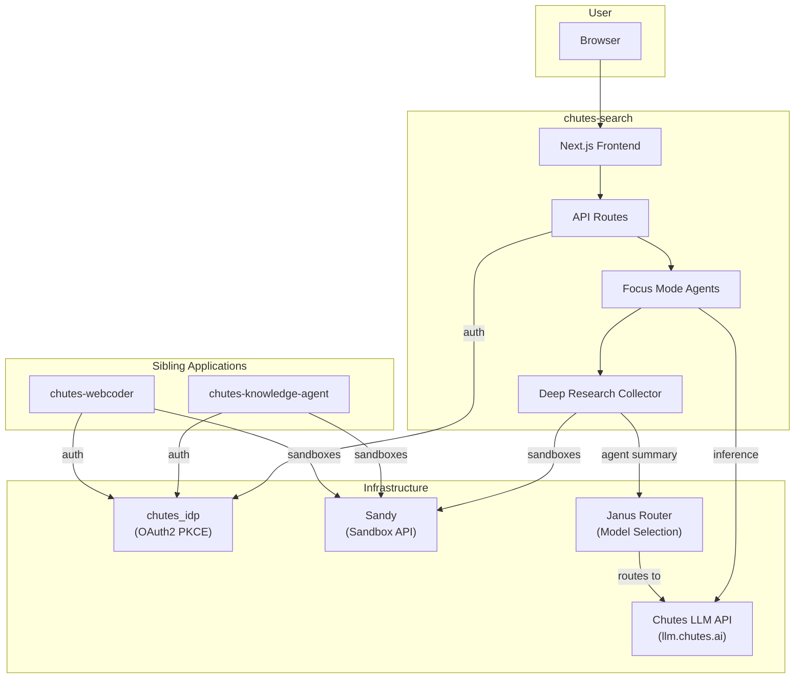

# Related Project Documentation

This document provides links to documentation for all projects in the Chutes platform ecosystem that interact with chutes-search. Each project has its own `docs2/` folder with detailed technical documentation.

---

## This Project

### chutes-search (Deep Research Engine)
**Location**: `./` (you are here)
**Documentation**: This folder (`chutes-search/docs2/`)

- [01-architecture-overview.md](01-architecture-overview.md) - Perplexica fork overview, focus modes, LLM providers, search backends
- [02-sandy-integration.md](02-sandy-integration.md) - Deep research sandbox lifecycle, crawler script, agent summarization
- [03-deployment.md](03-deployment.md) - Docker Compose setup, environment variables, SearxNG configuration

---

## Core Infrastructure

### Sandy (Sandbox Infrastructure)
**Location**: `../../sandy/docs/`
**Purpose**: Ephemeral sandbox infrastructure (Firecracker microVMs by default; restricted Docker sandboxes when explicitly requested) for secure code execution and agent hosting

chutes-search uses Sandy sandboxes for Deep Research. The collector creates a sandbox (typically Firecracker microVM by default), installs Playwright as needed, crawls web pages, and optionally runs a Claude Code agent for source summarization.

- [01-architecture-overview.md](../../sandy/docs/01-architecture-overview.md) - Platform architecture, deployment modes, API endpoints
- [02-security-model.md](../../sandy/docs/02-security-model.md) - Docker vs Firecracker, container hardening, access control
- [03-sandbox-lifecycle.md](../../sandy/docs/03-sandbox-lifecycle.md) - Creation flow, warm pool, resource limits, timeouts
- [04-agent-system.md](../../sandy/docs/04-agent-system.md) - CLI agents, agent packs, SSE streaming, system prompts
- [05-model-router.md](../../sandy/docs/05-model-router.md) - Janus task classifier, model registry, fallback strategy
- [06-ecosystem.md](../../sandy/docs/06-ecosystem.md) - All projects overview and how they interconnect
- [07-streaming-protocol.md](../../sandy/docs/07-streaming-protocol.md) - SSE event types, streaming formats, client handling

---

## Identity and Authentication

### chutes_idp (Identity Provider)
**Location**: `../../chutes_idp/docs2/`
**Purpose**: OAuth2 PKCE identity provider for the Chutes platform

chutes-search integrates with chutes_idp for user authentication. The OAuth2 PKCE flow enables users to sign in, and their access tokens (with `chutes:invoke` scope) are used to run inference on their own Chutes accounts. Deep Research requires authentication.

- [01-architecture-overview.md](../../chutes_idp/docs2/01-architecture-overview.md) - IDP architecture and endpoints
- [02-integration-guide.md](../../chutes_idp/docs2/02-integration-guide.md) - How to integrate OAuth2 PKCE
- [03-ecosystem-usage.md](../../chutes_idp/docs2/03-ecosystem-usage.md) - Usage across the Chutes ecosystem

---

## Related Applications

### chutes-knowledge-agent (Support Bot)
**Location**: `../../chutes-knowledge-agent/docs2/`
**Purpose**: Knowledge-base support bot using Claude Code in Sandy sandboxes

Like chutes-search, the knowledge agent uses Sandy sandboxes and the Janus model router for agent execution. Both projects share the same Sandy client patterns and Chutes IDP authentication flow.

- [01-architecture-overview.md](../../chutes-knowledge-agent/docs2/01-architecture-overview.md) - Architecture overview
- [02-knowledge-system.md](../../chutes-knowledge-agent/docs2/02-knowledge-system.md) - Knowledge base system
- [03-sandy-integration.md](../../chutes-knowledge-agent/docs2/03-sandy-integration.md) - Sandy integration details

---

## Competition Platform

### janus-poc (Competitive Intelligence API)
**Location**: `../../janus-poc/docs2/`
**Purpose**: Competitive AI agent platform with OpenAI Chat Completions API compatibility

The Janus model router, used by chutes-search for agent summarization in deep research, originates from the janus-poc project. When `SANDY_AGENT_MODEL` is set to `janus-router`, agent inference is routed through the Janus gateway for automatic model selection and fallback.

- [01-architecture-overview.md](../../janus-poc/docs2/01-architecture-overview.md) - Platform architecture
- [02-gateway.md](../../janus-poc/docs2/02-gateway.md) - API gateway and routing
- [03-baseline-agents.md](../../janus-poc/docs2/03-baseline-agents.md) - Baseline agent implementations
- [04-chat-ui.md](../../janus-poc/docs2/04-chat-ui.md) - Chat interface
- [05-benchmarking.md](../../janus-poc/docs2/05-benchmarking.md) - Agent benchmarking system

---

## How Projects Connect

### Integration Points Summary

| chutes-search Feature | Depends On | Integration Method |
|---|---|---|
| User authentication | chutes_idp | OAuth2 PKCE (authorization code + PKCE) |
| LLM inference (search) | Chutes LLM API | OpenAI-compatible REST API |
| Deep Research crawling | Sandy | REST API (create, exec, files, terminate) |
| Agent summarization | Sandy + Janus Router | Claude Code CLI in sandbox, routed through Janus |
| Web search | SearxNG / Serper | REST API (JSON format) |
